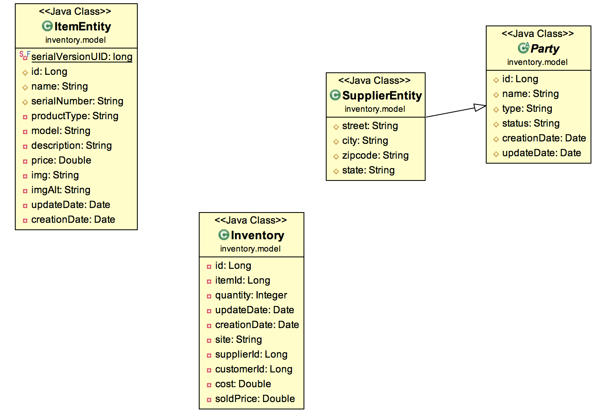
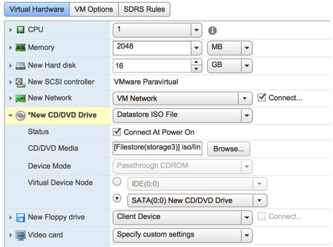
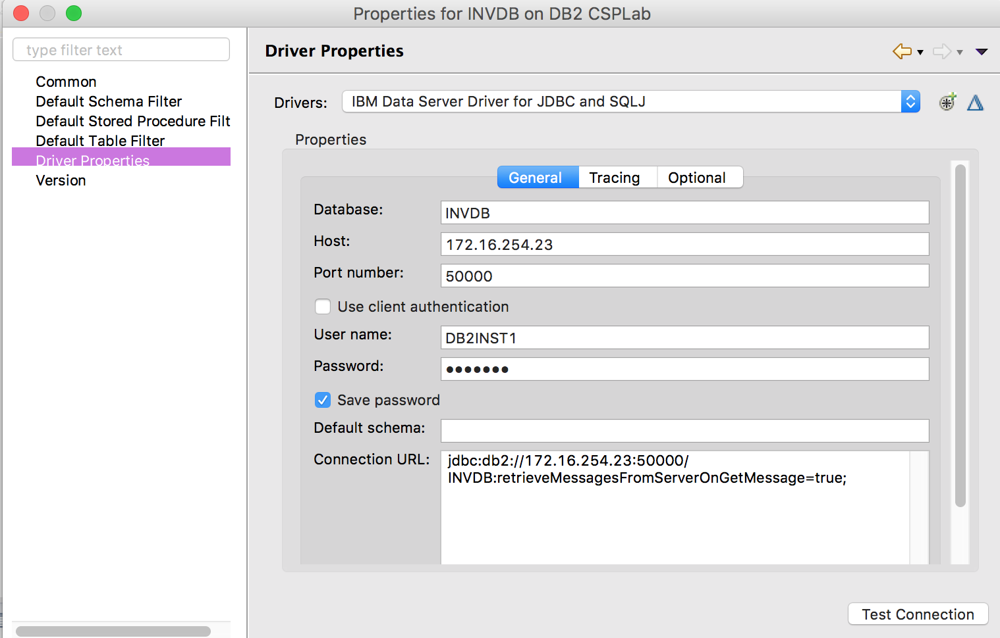

# DB2 Inventory Database
This project is part of the 'IBM Integration Reference Architecture' suite, available at [https://github.com/ibm-cloud-architecture/refarch-integration](https://github.com/ibm-cloud-architecture/refarch-integration).
This project represents on-premise deployment so you need a running DB2 server to install the database.

Updated - November 2018, we are reusing this project for a [lift and shift of MQ, WAS and DB2 workloads to the IBM Cloud ](https://github.com/ibm-cloud-architecture/refarch-integration/blob/master/docs/toSaaS/readme.md) (Public) solution. The migrate DB2 database tutorial can be read [here](docs/db2-cloud.md).

## Table of Contents
* [Project goals](#goals)
* [Run locally with docker or vagrant](#run-locally)
* [On premise installation](#db2-server-installation)
* [Lift and shift DB2 workload to IBM Cloud](docs/db2-cloud.md)
* [Deploy DB2 to ICP for development](docs/db2-icp.md)
* [Administer DB2 databases](#administer)

## Goals

This project supports scripts to create DB2 `Inventory` database and load it with 12 items related to old computers. This is to support data persistence for the `brown compute / hybrid integration` solution implementation demonstration. But it also includes another DB2 `Customers` database to support the `green compute` Customer churn scenario demonstration.

### For Inventory DB

The Data model looks like the following diagram:



The ItemEntity is mapped to a ITEMS table to persist item information
The SupplierEntity is mapped to the SUPPLIER table to persist information about the supplier delivering the item.
The Inventory is mapped to INVENTORY table to persist item allocated per site. When a new item is added the supplier id is used as foreign key to the SUPPLIER table.

### For Customers DB

The model defines three main tables: customers, accounts and products, and join tables as customer may own multiple products. Customer has one account only. To simplify our life.

## Run Locally 

To demonstrate the lift and shift scenario we are proposing three methods to run DB2 locally: docker, vagrant or vSphere.

### Using docker

The goal here is to use the IBM db2express-c base docker image and a set of scripts to prepare tables and load data. We have already prepare all this work and published the resulting docker image under the name: `ibmcase/browndb2`.

With DB2 in Docker it is recommended to use Volume to persist the data created by DB2. So the approach is to use a data only container and then reference this volume when creating the container instance to mount the volume under `/home/db2inst1` within the container. 

Here is an example of such approach, which starts a first container to create the `data only container` and then start the DB2 container using the volume. 
```
docker run -i  --name=db2_data -v /home/db2inst1 busybox true \
 && docker run -i --volumes-from=db2_data  --name=db2 ibmcom/db2express-c  /bin/bash 
```

But this is not what we used for this exercise. We used a build process, automated with the `builddb2docker.sh` to start the docker base image: ibmcom/db2express-c, then use a bash script to start DB2, create INVDB and configure the data. This is equivalent to do the following steps manually.

```shell
# Start the docker container
$ docker run --name=db2 -p 50000:50000  -e DB2INST1_PASSWORD=d'b2inst1' -e LICENSE='accept' -v $(pwd)/db-sql:/home/db2inst1/db-sql -i ibmcom/db2express-c /bin/bash
# change the user
$ su - db2inst1
# start db2
[db2inst1@9f3200f453e4 ~]$ db2start
# create the database
db2inst1@9f3200f453e4 ~]$ cd browndb/db-sql/inventory
db2inst1@9f3200f453e4 ~]$ ./createDB.sh
```

So with all this context, you have now a prepared image that you can start using the script `undb2docker.sh` which in fact performs the following docker run:

```shell
docker run --privileged=true --name db2 -p 50000:50000  -d ibmcase/browndb2  db2start
```

If you want to see the data in the DB you can always connect to the container and use db2 command. Here is a trace of such steps:

```shell
# Verify the DB2 docker runs
$ docker ps
CONTAINER ID        IMAGE               COMMAND                  CREATED             STATUS              PORTS                              NAMES
ee92e4a6c21c        ibmcase/browndb2    "/entrypoint.sh db2s…"   About an hour ago   Up About an hour    22/tcp, 0.0.0.0:50000->50000/tcp   db2

# Connect to the container and open a shell
$ docker exec -ti db2 /bin/bash
[root@ee92e4a6c21c /] su - db2inst1
[db2inst1@ee92e4a6c21c ~]$ db2

(c) Copyright IBM Corporation 1993,2007
Command Line Processor for DB2 Client 10.5.5
...

db2 => connect to INVDB
   Database Connection Information

 Database server        = DB2/LINUXX8664 10.5.5
 SQL authorization ID   = DB2INST1
 Local database alias   = INVDB

db2 => select id,name from items

ID          NAME                                                                                                
----------- ----------------------------------------------------------------------------------------------------
      13401 Dayton Meat Chopper                                                                                 
      13402 Hollerith Tabulator                                                                                
      13403 Computing Scale                                                                                     
      13404 Tape Controlled Card Punch                                                                          
      13405 Electric Card Collator                                                                              
      13406 Collator                                                                                            
      13407 Gang Summary Punch                                                                                  
      13408 Calculator                                                                                          
      13409 Proof Machine                                                                                       
      13410 Model 01 Typewriter                                                                                 
      13411 Model A Typewriter                                                                                  
      13412 Selectric Typewriter                                                                                

  12 record(s) selected.
```

From there you should be able to do the DB2 lift and shift scenario as describe in [this note](./docs/db2-cloud.md)

### Using Vagrant

## DB2 Server Installation

The following steps can be done manually to create a VM with REDHAT. We are using vmware vSphere center to manage our virtual machines:
* Create a vm machine for a REDHAT 7 (64 bits) OS using ESXi 5.5  
* Configure the virtual machine to start on RedHat .iso file (configure DVD to point to .iso file). Be sure to select connect at power on  

* Configure REDHAT: Attention spend time to go over each configuration items if not you may have to reinstall or the install will not complete.
[See this note from RedHat](https://developers.redhat.com/products/rhel/hello-world/#fndtn-vmware_get-ready-for-software-development], in particular the Software Selection: Server with GUI in the Base Environment: Select the target destination disk that will map the one configured at the virtual machine settings.
* Reboot and finalize the language and time settings.
* Create an *admin* user
* Once logged as *admin* on the newly operational OS, download the free version of DB2 Express v11 from [here](https://www-01.ibm.com/marketing/iwm/iwm/web/pick.do?source=swg-db2expressc) as a gz file
* Unzip the gz file under **/home/admin/IBM/expc**
* Login as root goes to **/home/admin/IBM/expc** and execute `./db2setup`. The wizard creates two users **db2inst1** and **db2fenc1**
* Once installation is done login as **db2inst1** and then validate your installation files, instance, and database functionality, run the Validation Tool, `/opt/ibm/db2/V11.1/bin/db2val`

When a database is created, there are several objects created by default: table spaces, tables, a buffer pool and log files.
 * Table space SYSCATSPACE contains the System Catalog tables.
 * Table space TEMPSPACE1 is used by DB2 when it needs additional space to perform some operations such as sorts.
 * Table space USERSPACE1 is normally used to store user database tables if there is no table space specified when creating a table
* The OS firewall was disabled
 ```
 $ systemctl status firewalld
 $ service firewalld stop
 $ systemctl disable firewalld
 ```
* If not done already, clone this repository as you need the INVDB scripts
```
git clone https://github.com/ibm-cloud-architecture/refarch-integration-inventory-db2.git
```
## Administer
### Inventory
The folder db-scripts includes shell scripts to create the INVDB and populate it with 12 items. This script has to be executed on the DB2 server as it uses db2 CLI.
```
$ createDB.sh
```

The project [refarch-integration-tests](https://github.com/ibm-cloud-architecture/refarch-integration-tests) includes Java and nodejs code to test each component of Brown compute solution and specially DB2 Inventory DB: the scripts is testInventoryDB2.sh.

### Customers

### DB2 command summary

|Command|Description|
|-------|---------|
|db2level|get the version of the product|
|db2licm -l|Get license info |
|db2val|Validate installation|
|db2ilist|to list instance created.  An instance is simply an independent environment where applications can run, and databases can be created. You can create multiple instances on a data server.  On Linux, an instance must match a Linux operating system user|
|db2icrt myinst|Create a new DB instance. But this is not necessary as db2inst1 is the instance created by installation. New instance means also new user created|
|db2start and db2stop|Performed while logged as db2inst1 user for example|
|db2 create database invdb|To create a database inside of the instance|
|db2 list tables for all|Get the list of all tables in the instance|
|db2 list tables for schema DB2INST1|For a given schema like db2inst1|
|db2 describe table items|See the structure of a table|
|db2 insert into <tab_name>(col1,col2,...)  values(val1,val2,..)|Insert data to table|
|db2 select id,name from items | select some columns and all rows for a given table|

## Verify DB2 is accessible

Using Eclipse DataBase Development perspective, define a new connection using the jdbc driver which can be found at: [refarch-premsource-inventory-dal](https://github.com/ibm-cloud-architecture/refarch-integration-inventory-dal)/lib/db2jcc4.jar  


The parameters are:
`jdbc:db2://172.16.254.23:50000/INVDB:retrieveMessagesFromServerOnGetMessage=true;`
Once connected you can perform some SQL query, update records, etc... Useful during development time.

Also note that the testing project has code to test DB2 availability. See [Integration tests](https://github.com/ibm-cloud-architecture/refarch-integration-tests)

## Update the DB schema
* It may be needed to adapt the schema by adding new columns to one table. To do so, you can use Eclipse Database development perspective and connect to the DB and use SQL script editor.
```
alter table items add column  serialNumber VARCHAR(50);
```
For more information about the `alter` command for DB2 see the [knowledge center note.](https://www.ibm.com/support/knowledgecenter/en/SSEPEK_11.0.0/sqlref/src/tpc/db2z_sql_altertable.html)

## Working on data

* removing row:
`delete from inventory where id = '531'`

## Common issues

While updating row or insert new row in a table, like INVENTORY, you may get a SQLERROR = -668.  You may need to reorganize the table. Connect to the DB using eclipse database development perspective, use a SQL script and perform the command:
`call ADMIN_CMD('REORG TABLE INVENTORY')`
update should work.

## DB2 Reference material for knowledge acquisition
* [Free e-book](http://publib.boulder.ibm.com/epubs/pdf/dsncrn01.pdf)
* [dw article](https://www.ibm.com/developerworks/data/newto/db2luw-getstarted.html)
* [Considerations for building and deploying DB2 Docker containers](https://developer.ibm.com/articles/dm-1602-db2-docker-trs/)
