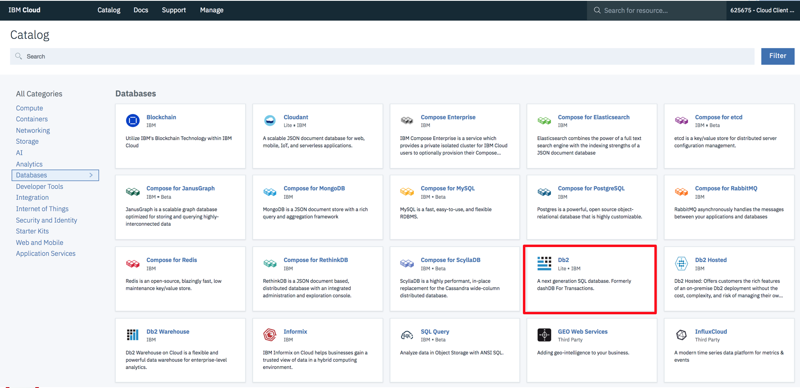
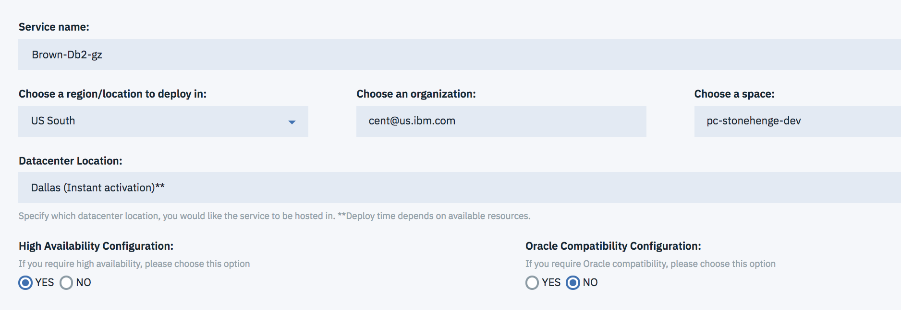
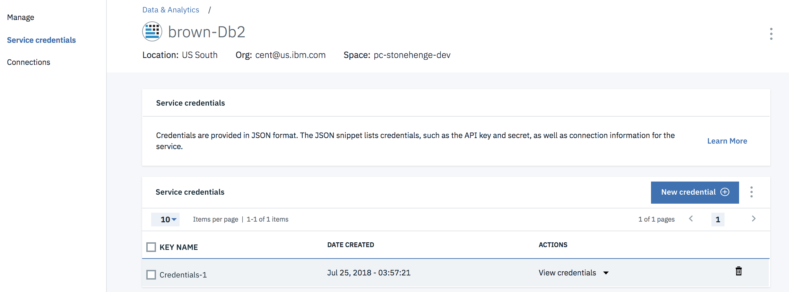
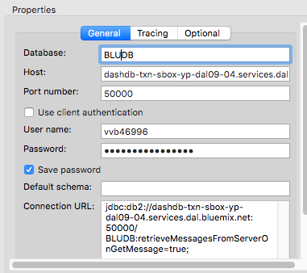

# Lift and Shift to DB2 on Cloud
We are presenting the process to lift and shift the Inventory database to DB2 hosted service on IBM Cloud.

## Create a DB2 on Cloud instance
Once logged to the IBM Cloud console, you can add a database resource and select DB2.



Select the region, space, configuration (HA) and the pricing plans to support your storage needs and performance requirements.



The created service is now listed in the `Cloud Foundry Services` in the Console Dashboard. From there you can select the service to reach its home page, where you can define the new credentials used for remote connection:



Once you have the connection, use your Java development environment to create a connection to the database. Here is an example of using Eclipse - Database Development perspective with the following settings:



Now we are ready to use other tools to do the migration.

## Migrate  

We are migrating to the most restrictive plan and will point out some of the limitations that drove our decisions and how you can decide differently if your plan does not have the same limitations. First we migrate using the native db2move, then the same migration is performed using the [Lift](https://lift.ng.bluemix.net/).

### Cataloging DB2 on Cloud

We are able to get to a command line on the existing database server so will work from there. Using [the instructions for connecting via SSL](https://www.ibm.com/support/knowledgecenter/en/SS6NHC/com.ibm.swg.im.dashdb.doc/connecting/connect_connecting_dsclient.html) we can connect to the new environment:

#### First we create a key database and add a certificate to it.

```
[db2inst1@BrownAppServer ssl]$ gsk8capicmd_64 -keydb -create -db "db2cloudclient.kdb" -pw "Brown01" -stash
[db2inst1@BrownAppServer ssl]$ ls -l
total 16
-rw-------. 1 db2inst1 db2iadm1  88 Aug  6 14:31 db2cloudclient.crl
-rw-------. 1 db2inst1 db2iadm1  88 Aug  6 14:31 db2cloudclient.kdb
-rw-------. 1 db2inst1 db2iadm1  88 Aug  6 14:31 db2cloudclient.rdb
-rw-------. 1 db2inst1 db2iadm1 129 Aug  6 14:31 db2cloudclient.sth

[db2inst1@BrownAppServer ssl]$ gsk8capicmd_64 -cert -add -db "db2cloudclient.kdb" -stashed -label "DigiCert" -file "DigiCertGlobalRootCA.crt" -format ascii -fips

[db2inst1@BrownAppServer ssl]$ db2 update dbm cfg using SSL_CLNT_KEYDB /home/db2inst1/ssl/db2cloudclient.kdb
DB20000I  The UPDATE DATABASE MANAGER CONFIGURATION command completed
successfully.
[db2inst1@BrownAppServer ssl]$ db2 update dbm cfg using SSL_CLNT_STASH /home/db2inst1/ssl/db2cloudclient.sth
DB20000I  The UPDATE DATABASE MANAGER CONFIGURATION command completed
successfully.
```

#### Then we catalog the remote database

```
[db2inst1@BrownAppServer ssl]$ db2 catalog tcpip node bmxssl remote dashdb-txn-sbox-yp-dal09-04.services.dal.bluemix.net server 50001 security ssl
DB20000I  The CATALOG TCPIP NODE command completed successfully.
DB21056W  Directory changes may not be effective until the directory cache is
refreshed.


[db2inst1@BrownAppServer ~]$ db2 catalog db bludb as invdbssl at node bmxssl
DB20000I  The CATALOG DATABASE command completed successfully.
DB21056W  Directory changes may not be effective until the directory cache is
refreshed.
```

#### Then we make sure we can connect with our new credentials

```
[db2inst1@BrownAppServer ssl]$ db2 connect to invdbssl user vvb46996 
Enter current password for vvb46996:

   Database Connection Information

 Database server        = DB2/LINUXX8664 11.1.3.3
 SQL authorization ID   = VVB46996
 Local database alias   = INVDBSSL

```

If a `SQL30081N` error is returned revisit the setup steps and troubleshoot the gskit error code that is also returned. Alternatively (and unsafely) you can use the non-SSL connection on port 50000 if your Db2 on Cloud instance has that port open.

### Exporting the Database

We are using the "db2move" utility to export our database. Several methods were evaluated for a few parameters and db2move was what we selected:

Tool | Downtime Considerations | Simplicity  
--- | ---- | -----  
db2move | Application is down from the start of export until the end of the movement. The exported schema should be evaluated to make sure all objects of interest are migrated. Handles BLOBs, CLOBs, and XML columns. | Very simple  
db2look, export, load | Application is down from when db2look is executed for some objects like sequences. Static tables can be exported and loaded early. If tables have timestamps they can be updated incrementally until an outage window. Can handle BLOBs, CLOBs, and XML columns. | Simple to complex depending on whether partial refreshes are desired.  
backup / restore | Not available for most plans, requires Db2 hosted and the ability to migrate from current database environment to target environment (same endian, etc) | Very simple but many limitations  
Federation / Replication | Modifies production or uses a new third environment as a bridge. Doesn't cover all objects (sequences, etc). Downtime depends on complexity requirements and modifications to the existing system possible. | Very simple to very complex  

On top of all this there can be specific objects that need special handling. Sequences have already been mentioned - the current values change as the application uses them and these are not exported in the same way as data. Another is external functions which may need to be recompiled and installed on the target system.

#### Exporting with db2move

The [db2move utility](https://www.ibm.com/support/knowledgecenter/en/SSEPGG_11.1.0/com.ibm.db2.luw.admin.cmd.doc/doc/r0002079.html) has a few actions and parameters so you can customize your move and what is exported. At its simplest you can issue `db2move export <database>` to export all user-create tables, data, and object. This can include tables created by tools and other utilities, which may not be desirable for importing into the new environment.


```
[db2inst1@BrownAppServer export]$ db2move invdb export

Application code page not determined, using ANSI codepage 1208

*****  DB2MOVE  *****

Action:  EXPORT

Start time:  Fri Aug  3 16:02:59 2018


Connecting to database INVDB ... successful!  Server : DB2 Common Server V11.1.1

EXPORT:    155 rows from table "SYSTOOLS"."HMON_ATM_INFO"
EXPORT:      0 rows from table "SYSTOOLS"."HMON_COLLECTION"
EXPORT:      2 rows from table "DB2INST1"."INVENTORY"
EXPORT:     12 rows from table "DB2INST1"."ITEMS"
EXPORT:      1 rows from table "DB2INST1"."OPENJPA_SEQUENCE_TABLE"
EXPORT:      5 rows from table "SYSTOOLS"."POLICY"
EXPORT:      2 rows from table "DB2INST1"."SUPPLIERS"
EXPORT:      4 rows from table "DB2INST1"."SUPPLIER_DELIVERS_ITEM"

Disconnecting from database ... successful!

End time:  Fri Aug  3 16:03:01 2018
```

We went with the simplest incantation. The db2move utility generates files based on the contents of the database. It generated this for us:  

```
-rw-r--r--. 1 nobody nobody    237 Aug  3 10:16 db2move.lst
-rw-r--r--. 1 nobody nobody    706 Aug  3 09:57 EXPORT.out
-rw-r--r--. 1 nobody nobody 106964 Aug  3 09:57 tab1.ixf
-rw-r--r--. 1 nobody nobody    143 Aug  3 09:57 tab1.msg
-rw-r--r--. 1 nobody nobody  10722 Aug  3 09:57 tab2.ixf
-rw-r--r--. 1 nobody nobody    141 Aug  3 09:57 tab2.msg
-rw-r--r--. 1 nobody nobody  11625 Aug  3 09:57 tab3.ixf
-rw-r--r--. 1 nobody nobody    141 Aug  3 09:57 tab3.msg
-rw-r--r--. 1 nobody nobody  23173 Aug  3 09:57 tab4.ixf
-rw-r--r--. 1 nobody nobody    142 Aug  3 09:57 tab4.msg
-rw-r--r--. 1 nobody nobody   3483 Aug  3 09:57 tab5.ixf
-rw-r--r--. 1 nobody nobody    141 Aug  3 09:57 tab5.msg
-rw-r--r--. 1 nobody nobody   6752 Aug  3 09:57 tab6a.001.lob
-rw-r--r--. 1 nobody nobody   8014 Aug  3 09:57 tab6.ixf
-rw-r--r--. 1 nobody nobody    141 Aug  3 09:57 tab6.msg
-rw-r--r--. 1 nobody nobody  10936 Aug  3 09:57 tab7.ixf
-rw-r--r--. 1 nobody nobody    141 Aug  3 09:57 tab7.msg
-rw-r--r--. 1 nobody nobody   3561 Aug  3 09:57 tab8.ixf
-rw-r--r--. 1 nobody nobody    141 Aug  3 09:57 tab8.msg
```

The `db2move.lst` file is a simple delimited list of tables and export files. We exported files from the SYSTOOLS schema, which we can ignore. These can be removed from the db2move.lst file and optionally the corresponding ixf and msg files can be deleted.

#### Importing into the cloud database

The plan we chose is the most limited, we can only create tables in our schema. Also, we cannot bind the db2move utility into the database because we do not have that authority. Instead we will create an import script. I used the following command pipeline to reformat the lines from db2move.lst into the appropriate import statements.  

```
cat db2move.lst | cut -d! -f 2-3 | tr "\!" " " | cut -d. -f 2 | tr '"' ' ' | while read TAB FILE; do echo db2 import from ${FILE}.ixf OF IXF REPLACE_CREATE INTO $TAB; done
```

Redirecting that to a file generates a script like this one:

```
import from tab3.ixf OF IXF REPLACE_CREATE INTO INVENTORY
import from tab4.ixf OF IXF REPLACE_CREATE INTO ITEMS
import from tab5.ixf OF IXF REPLACE_CREATE INTO OPENJPA_SEQUENCE_TABLE
import from tab7.ixf OF IXF REPLACE_CREATE INTO SUPPLIERS
import from tab8.ixf OF IXF REPLACE_CREATE INTO SUPPLIER_DELIVERS_ITEM
```

To run that, you must first connect to the target database, then execute it:  

```
[db2inst1@BrownAppServer export]$ db2 connect to invdbssl user vvb46996
Enter current password for vvb46996:

   Database Connection Information

 Database server        = DB2/LINUXX8664 11.1.3.3
 SQL authorization ID   = VVB46996
 Local database alias   = INVDBSSL

[db2inst1@BrownAppServer export]$ db2 -vf import_me.sql
import from tab3.ixf OF IXF REPLACE_CREATE INTO INVENTORY
SQL3150N  The H record in the PC/IXF file has product "DB2    02.00", date
"20180803", and time "160300".

SQL3153N  The T record in the PC/IXF file has name "tab3.ixf", qualifier "",
and source "            ".

SQL3109N  The utility is beginning to load data from file "tab3.ixf".

SQL3110N  The utility has completed processing.  "2" rows were read from the
input file.

SQL3221W  ...Begin COMMIT WORK. Input Record Count = "2".

SQL3222W  ...COMMIT of any database changes was successful.

SQL3149N  "2" rows were processed from the input file.  "2" rows were
successfully inserted into the table.  "0" rows were rejected.


Number of rows read         = 2
Number of rows skipped      = 0
Number of rows inserted     = 2
Number of rows updated      = 0
Number of rows rejected     = 0
Number of rows committed    = 2


import from tab4.ixf OF IXF REPLACE_CREATE INTO ITEMS
SQL3150N  The H record in the PC/IXF file has product "DB2    02.00", date
"20180803", and time "160300".

SQL3153N  The T record in the PC/IXF file has name "tab4.ixf", qualifier "",
and source "            ".

SQL3109N  The utility is beginning to load data from file "tab4.ixf".

SQL3110N  The utility has completed processing.  "12" rows were read from the
input file.

SQL3221W  ...Begin COMMIT WORK. Input Record Count = "12".

SQL3222W  ...COMMIT of any database changes was successful.

SQL3149N  "12" rows were processed from the input file.  "12" rows were
successfully inserted into the table.  "0" rows were rejected.


Number of rows read         = 12
Number of rows skipped      = 0
Number of rows inserted     = 12
Number of rows updated      = 0
Number of rows rejected     = 0
Number of rows committed    = 12


import from tab5.ixf OF IXF REPLACE_CREATE INTO OPENJPA_SEQUENCE_TABLE
SQL3150N  The H record in the PC/IXF file has product "DB2    02.00", date
"20180803", and time "160300".

SQL3153N  The T record in the PC/IXF file has name "tab5.ixf", qualifier "",
and source "            ".

SQL3109N  The utility is beginning to load data from file "tab5.ixf".

SQL3110N  The utility has completed processing.  "1" rows were read from the
input file.

SQL3221W  ...Begin COMMIT WORK. Input Record Count = "1".

SQL3222W  ...COMMIT of any database changes was successful.

SQL3149N  "1" rows were processed from the input file.  "1" rows were
successfully inserted into the table.  "0" rows were rejected.


Number of rows read         = 1
Number of rows skipped      = 0
Number of rows inserted     = 1
Number of rows updated      = 0
Number of rows rejected     = 0
Number of rows committed    = 1


import from tab7.ixf OF IXF REPLACE_CREATE INTO SUPPLIERS
SQL3150N  The H record in the PC/IXF file has product "DB2    02.00", date
"20180803", and time "160300".

SQL3153N  The T record in the PC/IXF file has name "tab7.ixf", qualifier "",
and source "            ".

SQL3109N  The utility is beginning to load data from file "tab7.ixf".

SQL3110N  The utility has completed processing.  "2" rows were read from the
input file.

SQL3221W  ...Begin COMMIT WORK. Input Record Count = "2".

SQL3222W  ...COMMIT of any database changes was successful.

SQL3149N  "2" rows were processed from the input file.  "2" rows were
successfully inserted into the table.  "0" rows were rejected.


Number of rows read         = 2
Number of rows skipped      = 0
Number of rows inserted     = 2
Number of rows updated      = 0
Number of rows rejected     = 0
Number of rows committed    = 2


import from tab8.ixf OF IXF REPLACE_CREATE INTO SUPPLIER_DELIVERS_ITEM
SQL3150N  The H record in the PC/IXF file has product "DB2    02.00", date
"20180803", and time "160301".

SQL3153N  The T record in the PC/IXF file has name "tab8.ixf", qualifier "",
and source "            ".

SQL3109N  The utility is beginning to load data from file "tab8.ixf".

SQL3110N  The utility has completed processing.  "4" rows were read from the
input file.

SQL3221W  ...Begin COMMIT WORK. Input Record Count = "4".

SQL3222W  ...COMMIT of any database changes was successful.

SQL3149N  "4" rows were processed from the input file.  "4" rows were
successfully inserted into the table.  "0" rows were rejected.


Number of rows read         = 4
Number of rows skipped      = 0
Number of rows inserted     = 4
Number of rows updated      = 0
Number of rows rejected     = 0
Number of rows committed    = 4
```

The nice thing about IXF files is that they include the table structure. Our import commands created (or replaced) the table in the target. We're only allowed to use our schema so I removed references to schema in the import statements. Each import statement processes the local IXF file and translates it into the appropate SQL activity on the server - so our files are local to originating database and were not transferred as files. Instead the DDL and DML were executed over the SSL connection we defined earlier.

That's it! Our (simple, tiny) data is now transferred over and applications can be re-pointed to the new environment.

## Migrate Using Lift

Lift is a feature-rich migration assistant that facilitates the copying of database objects from one source into a cloud environment. We only migrated the tables of interest from the Inventory database but other database objects including sequences, triggers, procedures, functions, auditpolicies, and views are supported. Lift performs the data migration in a series of steps, similar to using db2move.

### Install Lift

We installed Lift on the source database. It could also be installed on a completely separate environment, if desired. All Lift commands allow remote connections to both databases involved, when appropriate. 

We added the lift binary to our default PATH variable and created a property file (lift.properties) with approprite settings for our environment:  

```
source-schema=
source-database=
source-user=
source-password=
source-host=
source-database-port=
source-database-type=
target-user=
target-password=
target-host=
target-schema=
```

### Copy DDL to Cloud

We have to define the tables we are copying in the cloud environment. With Lift you can use the `ddl` sub-command to extract DDL from the source and apply it to the target. We ran `lift ddl --migrate --source-schema DB2INST1 --source-object ITEMS --properties-file lift.properties` to copy the ITEMS table. Note that our source schema was DB2INST1 and the target schema is locked to our username because of our plan. Schema names and object names are case sensitive at the command line. By default, DB2 names are in upper case.

```
[db2inst1@BrownAppServer bmx]$ lift ddl --migrate --source-schema DB2INST1 --source-object ITEMS --properties-file lift.properties
Generating DDL statement(s) for specified database objects...
Executing DDL statements for the specified database
Running operation 'create' on object 'ITEMS' of type 'table' in schema 'VVB46996'
Successfully ran 1 DDL statement(s).
DDL statements were successfully executed against the target database.
Database object migration operations finished.
```

### Extract Data Locally

Data must be exported from the table. We exported all rows but it is possible to provide a where clause to, for example, extract new/updated rows if you are doing a staged migration. It is also possible to extract only certain columns. You can also specify what size the result files should be before creating another file for the extract. We used the simple case that simply dumps all the data:  

```
[db2inst1@BrownAppServer bmx]$ lift extract --properties-file lift.properties --source-schema DB2INST1 --source-table INVENTORY
Extracting from table 'INVENTORY' to /home/db2inst1/bmx/DB2INST1.INVENTORY.csv

[##########] Extracted 304 B
Extracted 304 B (3 of 3 rows) from table 'INVENTORY' to /home/db2inst1/bmx/DB2INST1.INVENTORY.csv in 1 second(s) at an average rate of < 1 Mb/s
```

### Put the Extract in the Cloud

The extracted files need to be copied to a local filesystem in the cloud. This is accomplished with the `put` command and it simply copies a local file to the cloud, optionally renaming it. The target filesystem is "flat". Multiple files can be "put" in one command and will result in preserved filenames (but not paths). Local files can be in the current working directory or absolute paths can be specified.

```
[db2inst1@BrownAppServer bmx]$ lift put --properties-file lift.properties --file /home/db2inst1/bmx/DB2INST1.INVENTORY.csv
Putting file /home/db2inst1/bmx/DB2INST1.INVENTORY.csv (size 304B) at a maximum throughput of 500.00 Mb/s.
[##########] Put 304/304 B at < 1 Mb/s (0 sec remain)
Transferred file /home/db2inst1/bmx/DB2INST1.INVENTORY.csv in 2 seconds at average throughput of < 1 Mb/s.
The file transfer completed successfully.
```

### Load the Cloud Table

Now that the data is local to the Cloud instance it can be loaded. You can specify insert (default) to add new data or replace to empty the table first. There are several options in the case a file format other than something lift generated in the extract step is used.

```
[db2inst1@BrownAppServer bmx]$ lift load --properties-file lift.properties --filename DB2INST1.INVENTORY.csv --target-table INVENTORY --file-origin extract-db2
Loading file DB2INST1.INVENTORY.csv into VVB46996.INVENTORY
Loaded file DB2INST1.INVENTORY.csv into "VVB46996"."INVENTORY" in 3 seconds
Load Id: 1534960210242
Details
  Rows loaded: 3
  Rows skipped: 0
  Rows rejected: 0
  Rows deleted: 0
```

### Simple Lift Wrapper

If four steps are too many you can use this script either as-is or as a starting point to customize your move. Save the code as a file on a system that has bash installed (ksh may also work). It accepts three arguments: `-f <property file>` to specify your lift property file, as above; `-s <schema>` to specify the case-sensitive source schema; `-t <table>` to specify the case-sensitive name of the table to move. Optionally you can specify `-m` to turn on the migration step, otherwise the script assumes you have already migrated the DDL.

If any step encounters an error the script will stop.


```
#!/bin/bash

PROP=
SCHEMA=
TABLE=
MIGRATE=0

usage()
{
  echo "Usage: $0 -f <property file> -s <schema> -t <table>"
  echo " -f:    Provides the name of the lift.properties file"
  echo " -s:    Provides the schema of the table to move. Case sensitive"
  echo " -t:    Provides the name of the table to move. Case sensitive"
  echo " -m:    Turns on the migrate of the DDL step"
  echo ""
  echo "The lift properties file must have at least: "
  echo ""
  cat <<EOUSAGE
source-schema=
source-database=
source-user=
source-password=
source-host=
source-database-port=
source-database-type=
target-user=
target-password=
target-host=
target-schema=
EOUSAGE

}

while getopts ":f:t:s:m" flag
do
  case $flag in
    f) PROP=$OPTARG;;
    s) SCHEMA=$OPTARG;;
    t) TABLE=$OPTARG;;
    m) MIGRATE=1;;
    *) "echo $flag not recognized";usage;exit;;
  esac
done

if [ "$PROP" == "" ]; then
  echo "Property file required"
  usage
  exit
else
  if [ ! -f $PROP ]; then
    echo "Property file not a file: $PROP"
    usage
    exit
  fi
fi
if [ "$SCHEMA" == "" ]; then
  echo "Schema name required"
  usage
  exit
fi
if [ "$TABLE" == "" ]; then
  echo "Table name required"
  usage
  exit
fi


#Copy DDL
if [ $MIGRATE -eq 1 ]; then
  echo "copying DDL"
  lift ddl --properties-file $PROP --migrate --source-schema $SCHEMA --source-object $TABLE
  RC=$?
  if [ $RC -ne 0 ]; then
    echo "Migrate of the DDL for $TABLE failed, make sure the case is correct and the table exists. Check previous output for more information"
    exit
  fi
fi
#extract
echo "starting extract"
lift extract --properties-file $PROP --source-schema $SCHEMA --source-table $TABLE -f ${SCHEMA}.${TABLE}.csv --replace
RC=$?
if [ $RC -ne 0 ]; then
  echo "Extract for $TABLE failed, make sure the case is correct and the table exists. Check previous output for more information"
  exit
fi
#put
echo "starting stage"
lift put --properties-file $PROP --file ${SCHEMA}.${TABLE}.csv --replace
RC=$?
if [ $RC -ne 0 ]; then
  echo "Staging of extract file for $TABLE failed, make sure the case is correct and the table exists. Check previous output for more information"
  exit
fi
#load
echo "starting load"
lift load --properties-file $PROP --filename ${SCHEMA}.${TABLE}.csv --target-table $TABLE --file-origin extract-db2
RC=$?
if [ $RC -ne 0 ]; then
  echo "Loading of extract file for $TABLE failed, make sure the case is correct and the table exists. Check previous output for more information"
  exit
fi
echo "all done!"
```

Using this to migrate a table looks like this:

```
[db2inst1@BrownAppServer bmx]$ ./liftit -f lift.properties -s DB2INST1 -t SUPPLIERS -m
copying DDL
Generating DDL statement(s) for specified database objects...
Executing DDL statements for the specified database
Running operation 'create' on object 'SUPPLIERS' of type 'table' in schema 'VVB46996'
Successfully ran 1 DDL statement(s).
DDL statements were successfully executed against the target database.
Database object migration operations finished.
starting extract
Extracting from table 'SUPPLIERS' to /home/db2inst1/bmx/DB2INST1.SUPPLIERS.csv

[##########] Extracted 125 B
Extracted 125 B (2 of 2 rows) from table 'SUPPLIERS' to /home/db2inst1/bmx/DB2INST1.SUPPLIERS.csv in 1 second(s) at an average rate of < 1 Mb/s
starting stage
Putting file /home/db2inst1/bmx/DB2INST1.SUPPLIERS.csv (size 125B) at a maximum throughput of 500.00 Mb/s.
[##########] Put 125/125 B at < 1 Mb/s (0 sec remain)
Transferred file /home/db2inst1/bmx/DB2INST1.SUPPLIERS.csv in 8 seconds at average throughput of < 1 Mb/s.
The file transfer completed successfully.
starting load
Loading file DB2INST1.SUPPLIERS.csv into VVB46996.SUPPLIERS
Loaded file DB2INST1.SUPPLIERS.csv into "VVB46996"."SUPPLIERS" in 1 seconds
Load Id: 1534960210248
Details
  Rows loaded: 2
  Rows skipped: 0
  Rows rejected: 0
  Rows deleted: 0
all done!
```


